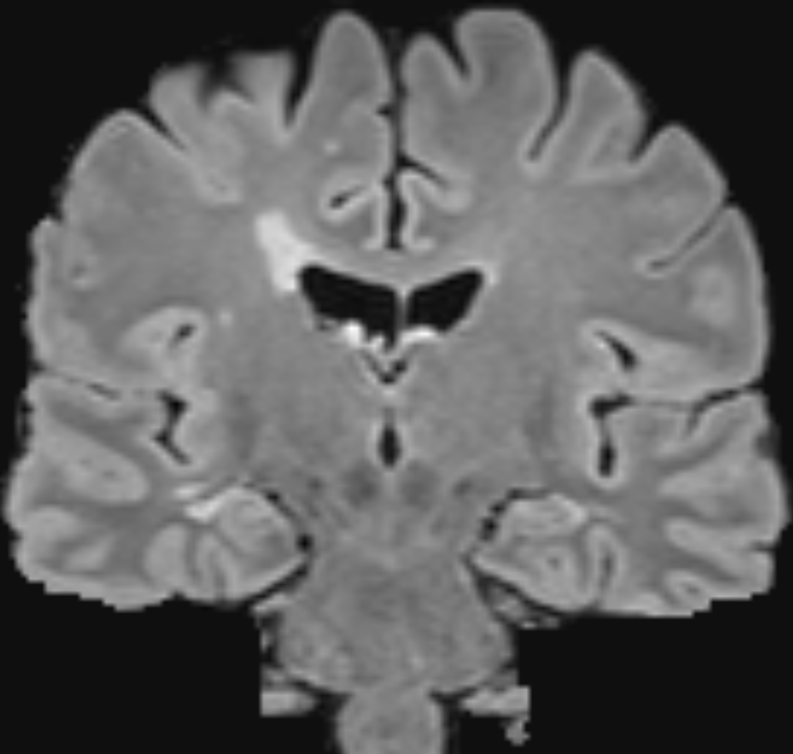
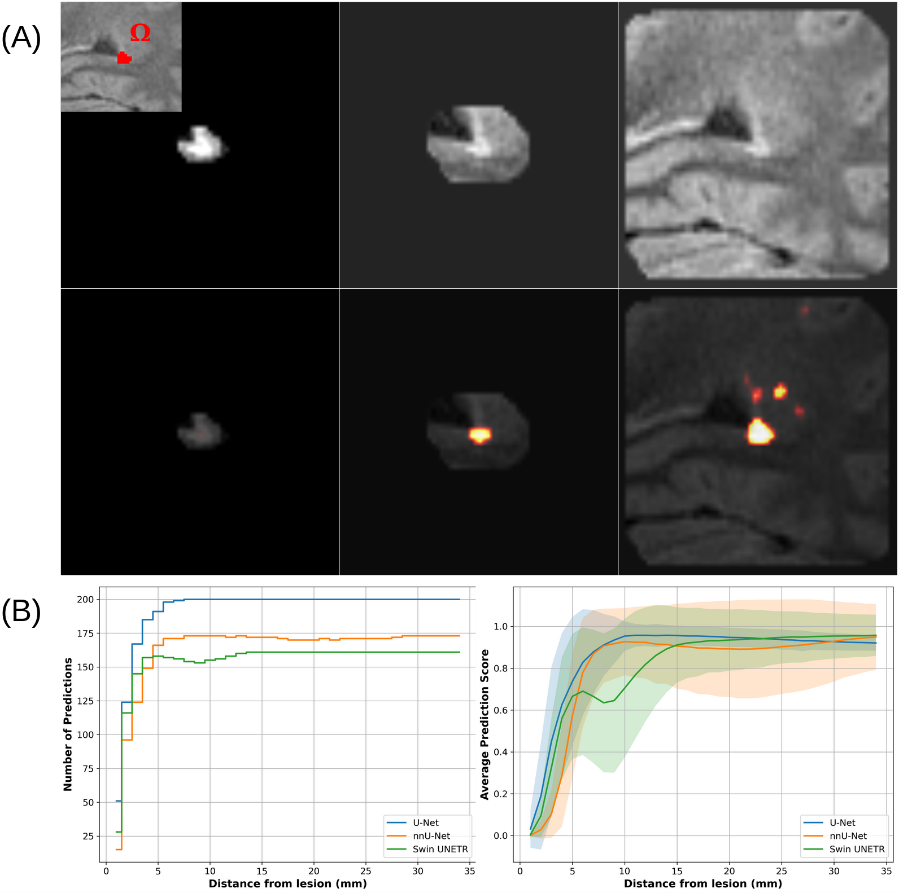

<h1 align="center">IES: Instance-level Explanation Saliency </h1>

> Scripts to generate explainable saliency maps for semantic/instance segmentation tasks.<br /> `IES` can help explaining decisions of machine learning networks performing segmentation tasks on images.

## 🚀 Usage

First, make sure you have python >=3.9 installed.

To build the environment, an installation of conda or miniconda is needed. Once you have it, please use
```sh
conda env create -f environment.yml
```
to build the tested environment using the provided `environment.yml` file. 

The script `ies.py` provides the instance-level explanation maps, obtained with methods based on SmoothGrad (average aggregation method) and GradCAM++. The script `ies_maxpool.py` provides the same maps using the max aggregation method.
Usage is the following:
```sh
python {FILENAME}.py --model_checkpoint unet_epoch_31.pth --input_val_paths {PATH_TO_INPUT1} {PATH_TO_INPUT2} --input_prefixes {INPUT1_FILENAME} {INPUT2_FILENAME} --target_val_path {TARGET_PATH} --target_prefix {TARGET_FILENAME} --num_workers 0 --cache_rate 0.01 --threshold 0.3
```
The script `ies_maxpool_nets.py` computes and saves XAI maps based on SmoothGrad (max aggregation method) for two other SOTA networks: nnU-Net and Swin UNETR. Usage is the following:
```
python ies_maxpool_nets.py --model_checkpoint nn-unet_epoch_31.pth --input_val_paths {PATH_TO_INPUT1} {PATH_TO_INPUT2} --input_prefixes {INPUT1_FILENAME} {INPUT2_FILENAME} --target_val_path {TARGET_PATH} --target_prefix {TARGET_FILENAME} --num_workers 0 --cache_rate 0.01 --threshold 0.4 --model nn-unet
```
and
```
python ies_maxpool_nets.py --model_checkpoint swin_epoch_41.pth --input_val_paths {PATH_TO_INPUT1} {PATH_TO_INPUT2} --input_prefixes {INPUT1_FILENAME} {INPUT2_FILENAME} --target_val_path {TARGET_PATH} --target_prefix {TARGET_FILENAME} --num_workers 0 --cache_rate 0.01 --threshold 0.4 --model swin_unetr --use_checkpoint
```

<div style="display: flex; justify-content: center;">
  
  
</div>

<p align="center"><em>Figure 1: FLAIR coronal view with a visible periventricular lesion (left), instance-level explanation saliency generated with nnU-Net.</em></p>

<div style="display: flex; justify-content: center;">
  
  
</div>

<p align="center"><em>Figure 2: FLAIR coronal view with a visible periventricular lesion (left), instance-level explanation saliency generated with Swin UNETR.</em></p>

To reproduce the experiment on the perilesional information used by networks to detect lesions, run sequentially script `contextual_info_nets_csv.py` and `contextual_info_plot.py` with the following:
```
python contextual_info_nets_csv.py --model_checkpoint {checkpoint.pth} --input_val_paths {PATH_TO_INPUT1} {PATH_TO_INPUT2} --target_val_path {TARGET_PATH} --input_prefixes {INPUT1_FILENAME} {INPUT2_FILENAME} --target_prefix {TARGET_PATH} --num_workers 0 --cache_rate 0.01 --threshold {0.3 for unet, 0.4 else} --model {network}
```
and to plot
```
python contextual_info_plot.py
```
editing folders name in the script as needed.

<div style="display: flex; justify-content: center;">
  
</div>

<p align="center"><em>Figure 3: Plots representing the number of segmented lesions (left) and the average across patients of the mean prediction score (right) at each dilation step for three tested networks (the transparency for each line represents its standard deviation).</em></p>

## Code Contributors

This work is part of the project MSxplain, and a pre-print is available at https://doi.org/10.48550/arXiv.2406.09335 (arXiv).

## Author

👤 **Federico Spagnolo**

- Github: [@federicospagnolo](https://github.com/federicospagnolo)
- | [LinkedIn](https://www.linkedin.com/in/federico-spagnolo/) |

## References

1. Spagnolo, F., Molchanova, N., Schaer, R., Bach Cuadra, M., Ocampo Pineda,
M., Melie-Garcia, L., Granziera, C., Andrearczyk, V., Depeursinge, A.: Instance-
level quantitative saliency in multiple sclerosis lesion segmentation. arXiv (2024).
https://doi.org/10.48550/ARXIV.2406.09335
